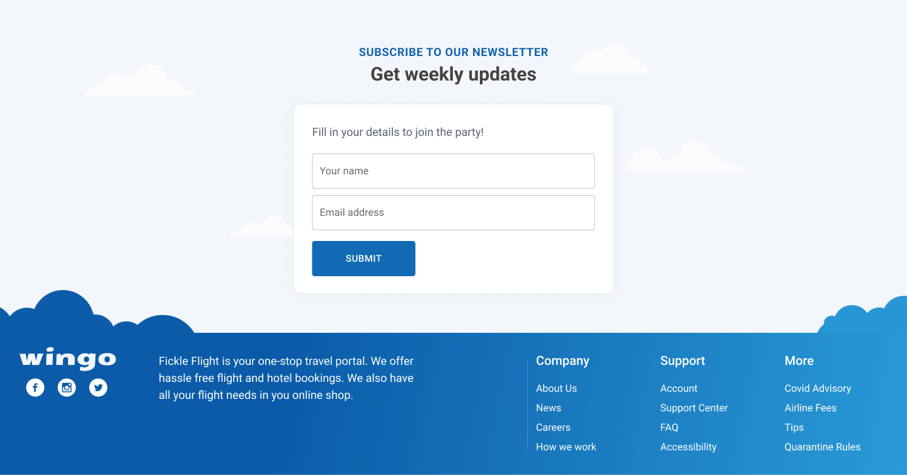
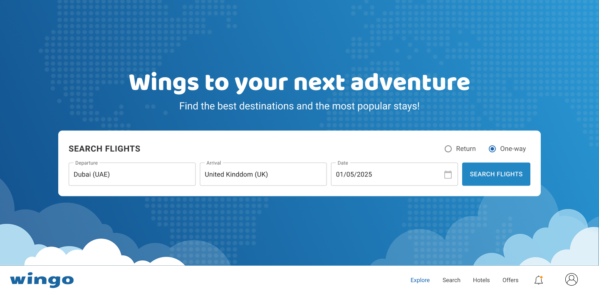
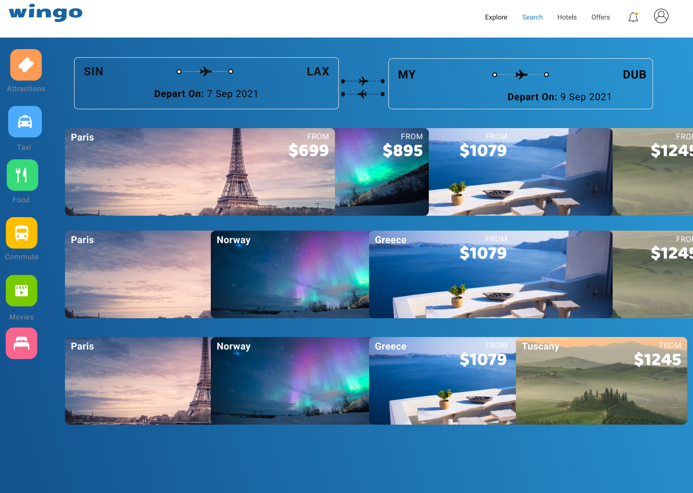

# booking-uiux
A collection of UI/UX design projects created using Figma and Adobe XD
# ✈️ Flight Booking App – UI/UX Design

This repository contains a clean and user-friendly **Flight Booking App UI** created in **Figma**.  
It includes screens for logging in, searching for flights, and viewing available flight options.

---

## 🔗 Figma File

➡️ [Download FlightBookingUI.fig](./booking.fig)

---

## 🖼️ UI Screens Preview

### 🔐 Login Screen
Users can securely log in with their credentials to begin the booking process.

---

### 🔎 Flight Search Screen
Search flights by selecting origin, destination, travel date, and number of passengers.

---

### 📋 Flight Results Screen
A list of available flights is displayed with time, price, and airline details.

---

## 🧰 Tools Used

- **Figma** – For design and prototyping
- Auto Layout, Frame Constraints, and Components
- Mobile-first UI layout

---

## 📁 Files Included

- `FlightBookingUI.fig` – Figma design file
- `login.png` – Login page preview
- `search.png` – Search page preview
- `result.png` – Flight results preview

---

## 👤 Author

Designed by **Aswin Kumar**  
📧 [aswinkumar.btech25@gmail.com](mailto:aswinkumar.btech25@gmail.com)

---

⭐ Feel free to use or reference this project for learning, practice, or portfolio building.
